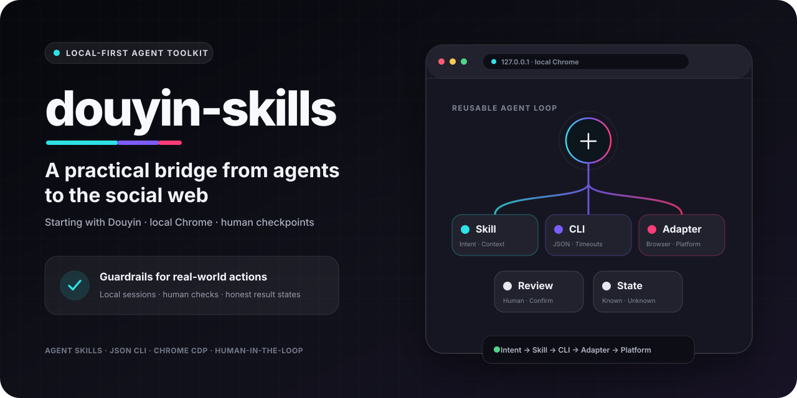
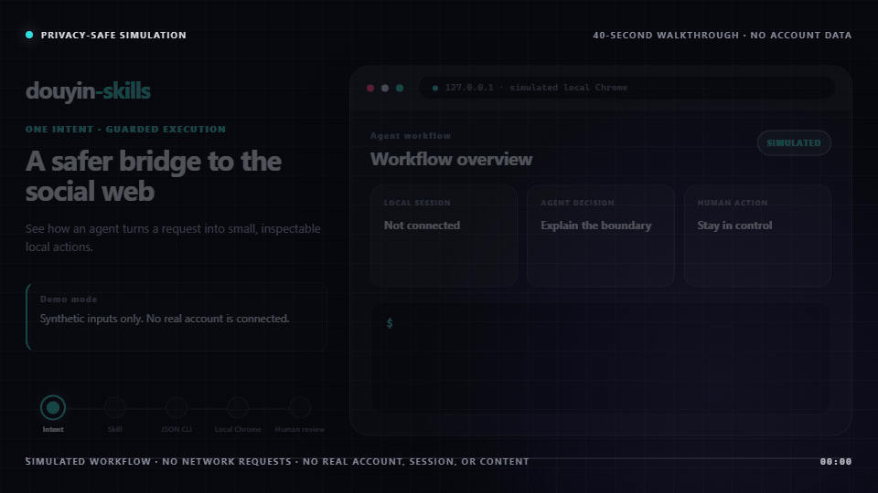
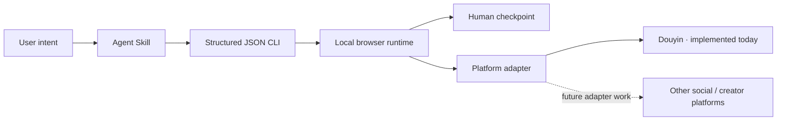
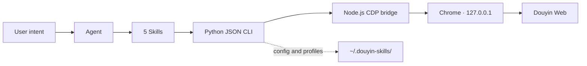

<p align="right"><a href="./README.zh-CN.md">中文</a></p>

<p align="center">
  
</p>

<h1 align="center">douyin-skills</h1>

<p align="center">
  Local-first agent workflows for the social web—starting with Douyin.
</p>

<p align="center">
  <a href="https://github.com/zJay26/douyin-skills/actions/workflows/ci.yml"></a>
  <a href="https://github.com/zJay26/douyin-skills/stargazers"></a>
  <a href="./LICENSE"></a>
  <a href="https://agentskills.io"></a>
  <a href="https://docs.openclaw.ai/skills"></a>
  
</p>

> [!IMPORTANT]
> This repository implements Douyin workflows today. Support for other Agent clients and social platforms is a direction, not a shipped compatibility claim. It is not an official Douyin product, and it does not provide bulk engagement or platform-control bypasses.

## Why this project exists

Agents can plan a multi-step task, but the social web is where plans meet stateful logins, changing pages, risk checks, and buttons with real consequences. A publishing click cannot be treated like a harmless text-generation step, and an uncertain result should not be reported as success.

`douyin-skills` is a concrete attempt to make that boundary easier to inspect and reuse. It packages intent as versioned Skills, exposes browser actions through a structured JSON CLI, keeps account sessions in local Chrome, and stops for human review when the page or outcome is uncertain.

Douyin is the current proving ground: a major social platform with real creator workflows and enough operational friction to test whether an agent integration is actually dependable. The project is intentionally narrower than a social-media management suite; it focuses on small, verifiable actions that can become reliable building blocks.

## What works today

Everyday Douyin web tasks are not inherently complicated, but browser startup, login state, page transitions, and publish review can interrupt your flow. `douyin-skills` turns those steps into five composable Skills: your agent understands the intent, then acts through Chrome on your computer.

| What you can say | Capability | Guardrail |
| --- | --- | --- |
| “Check login and show me the QR code if needed” | QR, SMS verification, multiple accounts | The user completes verification |
| “Find five weekend camping posts” | Keyword search, video/photo details | Up to 20 public posts per search |
| “Show me the current Douyin hot topics” | Read public trending topics | Up to 20; page drift is reported explicitly |
| “Fill in these photos or this video, but do not publish” | Uploads, copy, cover/music, page validation | Review first; no publish click |
| “Everything looks right—publish it” | Explicit publish confirmation | Never retry an unknown result |
| “Comment ‘学到了！！’ on this post” | One bounded public comment attempt | Confirmed, unconfirmed, and unavailable states are distinct |
| “Favorite this post and send me its link” | Like, favorite, share URL | No bulk actions or inflated claims |

What makes it different:

- **Built for everyday users**: install it, then describe the task instead of learning CDP or selectors.
- **Agent-readable contract**: Skill instructions and JSON results make the workflow reviewable instead of hiding behavior in prompts.
- **Local-first**: Chrome and account profiles stay on your computer; the debug endpoint only listens on `127.0.0.1`.
- **Fails safely**: publishing requires validation and explicit confirmation; risk pages and uncertain outcomes stop for human review.
- **Composable**: authentication, environment, discovery, publishing, and interactions work independently or as a workflow.
- **Drift-aware**: sanitized fixtures lock down how login, risk, search, trending-topic, detail, and publish states are interpreted without storing account data.
- **Maintainable**: one JSON CLI, focused regression tests, cross-platform CI, and Skills that document the real runtime contract.

## See the guarded workflow

<p align="center">
  
</p>

This 40-second walkthrough is entirely synthetic: it makes no network requests and contains no real Douyin page, account, cookie, QR code, phone number, profile path, or user content. It demonstrates the control flow and deliberately ends at **Prepared · not published**. It is not evidence that a live page version or account passed end-to-end validation.

The source is [`assets/demo/index.html`](./assets/demo/index.html). Maintainers with Chrome and FFmpeg can reproduce the GIF with `npm run render:demo`.

## Start in three minutes

### OpenClaw: full bundled experience (recommended)

```bash
openclaw skills install git:zJay26/douyin-skills@main
```

Then tell your agent:

> Use `douyin-env` to install dependencies and run the environment checks.

This installation command and nested Skill discovery model follow the [official OpenClaw documentation](https://docs.openclaw.ai/skills).

### Manual runtime setup

```bash
git clone https://github.com/zJay26/douyin-skills.git
cd douyin-skills
npm install
python scripts/cli.py doctor
```

You can also choose **Code → Download ZIP** on GitHub, extract the complete directory, and run the same `npm install` and `doctor` commands. Replace `python` with `python3` if needed.

The environment is ready when the JSON from `doctor` contains `"success": true` and an empty `required_failures` list.

### Stable release download

For a versioned, checksum-verifiable install, download `douyin-skills-v1.4.0.zip` and `SHA256SUMS` from the [v1.4.0 Release](https://github.com/zJay26/douyin-skills/releases/tag/v1.4.0). Verify the ZIP before extracting it:

```bash
# Linux / macOS
sha256sum -c SHA256SUMS

# Windows PowerShell: compare this value with the matching SHA256SUMS line
Get-FileHash .\douyin-skills-v1.4.0.zip -Algorithm SHA256
```

The named ZIP contains the complete repository under one versioned directory, including the privacy-safe Demo. GitHub's automatic source archives are separate and are not covered by the published checksum.

## Your first workflow

1. **Check the environment**

   > Use `douyin-env` to configure and verify this Skill.

2. **Sign in**

   > Check Douyin login with the default account. If I am signed out, show me the QR code.

3. **Describe the task**

   > Search for “city night photography” and return five titles, authors, content types, and links.

   > With my work account, fill the photo-publishing form with these three images and this caption. Pick suitable music, but stop before publishing.

4. **Confirm publishing separately**

   > I reviewed the page. Publish once, and do not retry if the result is not explicitly confirmed.

The first login creates an isolated local Chrome profile. Later commands reuse an available local Chrome debugging instance instead of restarting an already signed-in headed browser just to satisfy the default headless preference. If Douyin presents a captcha, identity check, or risk page, the CLI switches to a visible browser when a safe, tracked mode transition is needed and waits for you to complete it manually.

## Why this matters to the Agent ecosystem

The larger contribution is not a claim that one repository has solved every social platform. It is a working separation between what an agent decides and what a real browser is allowed to do.

| Layer | What this repository demonstrates | What may transfer |
| --- | --- | --- |
| Skill contract | Versioned intent, steps, guardrails, and failure handling in `SKILL.md` | Any client that understands the open Agent Skills format |
| Execution contract | Explicit arguments and structured JSON results | Other agent or tool surfaces can wrap the same stable CLI boundary |
| Local session | Isolated Chrome profiles and loopback-only CDP | Workflows where users must stay signed in without exporting sessions |
| Human checkpoint | Visible-browser verification and explicit publish confirmation | Other risk-sensitive or irreversible web actions |
| Result semantics | Confirmed, failed, and clicked-but-unconfirmed are different states | Agents can avoid confident but false completion reports |
| Platform adapter | Douyin URLs, selectors, and creator flows live behind shared runtime pieces | A future platform can replace its adapter without discarding every guardrail |

The root [`SKILL.md`](./SKILL.md) follows the open [Agent Skills specification](https://agentskills.io/specification), which is designed for portable, version-controlled agent knowledge. OpenClaw follows that specification and currently provides the documented installation path for this repository. Execution on other Agent Skills clients is not part of CI yet, so treat cross-client use as integration work rather than plug-and-play support.

This distinction matters: the repository offers a reusable pattern today, not a universal compatibility badge.

### Who may find the pattern useful

- **Operators** who want useful automation without handing browser sessions to a hosted control service.
- **Agent builders** looking for a concrete contract between model intent and stateful browser actions.
- **Tool and client maintainers** exploring how Agent Skills, CLIs, or tool protocols can share one execution core.
- **Researchers and reviewers** interested in human checkpoints, uncertainty, and honest completion semantics.

## Starting with Douyin, not ending there

The current implementation is specific to Douyin. Its URLs, selectors, login pages, creator forms, and content types must not be presented as portable code. The surrounding architecture is more general:



A future adapter for another social or creator platform could reuse the Skill-to-CLI boundary, browser lifecycle, local profiles, timeouts, validation states, and human-review policy. It would still need its own authorized login flow, URLs, selectors, domain rules, tests, and platform-policy review.

No other platform adapter ships in this repository today. See the [Agent ecosystem design note](./docs/AGENT_ECOSYSTEM.md) for the portability boundary, the [Adapter authoring guide](./docs/ADAPTER_AUTHORING.md) for the maintainer checklist, and [ROADMAP.md](./ROADMAP.md) for the staged plan.

## Five composable Skills

| Skill | Responsibility | Example intent |
| --- | --- | --- |
| [`douyin-auth`](./skills/douyin-auth/SKILL.md) | Login state, QR, SMS verification, multiple accounts | “Switch to my work account and check login” |
| [`douyin-explore`](./skills/douyin-explore/SKILL.md) | Search public posts, read video/note details, and inspect trending topics | “Find seven camping posts” |
| [`douyin-publish`](./skills/douyin-publish/SKILL.md) | Fill photo/video posts, set cover or music, validate, confirm | “Prepare this post for my review” |
| [`douyin-interact`](./skills/douyin-interact/SKILL.md) | One like/favorite/comment attempt or a public share URL | “Comment this and return the result” |
| [`douyin-env`](./skills/douyin-env/SKILL.md) | Installation, diagnostics, migration | “Check Chrome and dependencies” |

The root [`SKILL.md`](./SKILL.md) routes multi-step requests. Child Skills address scripts with OpenClaw's recommended [`{baseDir}` convention](https://docs.openclaw.ai/tools/creating-skills), so execution does not depend on the agent's current working directory.

## Safety model and scope

### What it does

- Operates public pages on Douyin Web and Creator Center Web.
- Keeps login state in loopback-only Chrome and supports named, isolated profiles.
- Shows the browser and waits when captcha or identity verification is required.
- Checks the selected media type, title, body, upload evidence, cover/music, and button state before publishing.
- Returns explicit states for uncertain page outcomes and asks for human verification.

### What it deliberately does not do

- Bypass captchas, identity checks, risk controls, or platform rate limits.
- Reply to comments, send direct messages, manage drafts, or schedule posts.
- Farm accounts, inflate engagement, scrape entire profiles, or run bulk operating pipelines.
- Retry when publishing is uncertain, or click like/favorite again when the final state is unknown.

> [!WARNING]
> Web interfaces change and automation may be restricted by the platform. Use a reasonable frequency and verify important actions on the actual page. You remain responsible for applicable law, platform rules, and content permissions.

## Implementation architecture



- `scripts/cli.py` is the only public command entry point and always produces JSON.
- Python uses only the standard library; the Node.js side only depends on the lockfile-pinned `ws` package.
- The Chrome launcher handles cross-platform browser discovery, port checks, profile isolation, reuse of existing debugging instances, and necessary headless/headed transitions.
- The CDP bridge drives pages through timeout-bounded HTTP/WebSocket calls without exposing the debug port to LAN or public networks.
- Page logic is split into authentication, discovery, publishing, and interaction modules, with shared URL, wait, and error handling.
- Platform-facing behavior is kept behind an explicit adapter; the [ecosystem design note](./docs/AGENT_ECOSYSTEM.md) describes the reusable boundary, and the [Adapter authoring guide](./docs/ADAPTER_AUTHORING.md) describes the evidence needed before another adapter can be claimed as supported.

## Requirements

| Component | Minimum / requirement |
| --- | --- |
| Python | 3.9+, standard library only |
| Node.js | 18+ |
| npm | Used by `npm install` / `npm ci` |
| Chrome / Chromium | Must support remote debugging |
| Graphical display | Only needed for human captcha, identity, or risk checks |

The CLI searches PATH and common browser locations on Windows, macOS, Linux, and WSL. You can also specify an executable explicitly:

```bash
CHROME_BIN=/absolute/path/to/chrome python scripts/cli.py doctor
```

When a Linux container runs as root, the launcher adds Chrome's required `--no-sandbox` flag. It does not disable the browser sandbox for regular users.

## CLI reference

Every command returns JSON. Put global account options before the subcommand:

```bash
python scripts/cli.py --account work check-login
```

Discover the installed runtime and result-contract versions without launching Chrome:

```bash
python scripts/cli.py version
```

Agent integrations should follow the stable minimum fields and certainty rules in the [JSON result contract](./docs/RESULT_CONTRACT.md).

| Area | Command | Purpose |
| --- | --- | --- |
| Runtime | `version` | Return project and result-contract versions without Chrome |
| Environment | `doctor` | Check Python, Node.js, `ws`, Chrome, and display availability |
| Auth | `check-login` | Inspect login, risk, and human-verification state |
| Auth | `get-qrcode` / `wait-login` | Retrieve a QR image and wait once for scanning |
| Auth | `send-code` / `verify-code` | Send and verify an SMS code |
| Accounts | `list-accounts` | List named accounts and the current default |
| Accounts | `add-account` / `remove-account` | Register or remove a named account |
| Accounts | `set-default-account` | Select the default named account |
| Discovery | `search-videos` | Keyword search; seven by default, twenty maximum |
| Discovery | `get-trending-topics` | Read public trending topics; twenty maximum |
| Discovery | `get-video-detail` | Read a numeric ID or public video/note URL |
| Publishing | `fill-publish-image` | Validate absolute image paths and fill the photo form |
| Publishing | `select-music` | Select the first available candidate by name |
| Publishing | `validate-publish` | Inspect fields and button state without publishing |
| Publishing | `click-publish --confirm` | Explicitly confirm one publish click |
| Publishing | `fill-publish-video` | Upload one local video, fill exact copy, and optionally set a custom cover |
| Publishing | `set-video-cover` | Set a custom cover on the current video form |
| Publishing | `validate-publish-video` | Inspect video upload, copy, cover, topic, and button state without publishing |
| Publishing | `click-publish-video --confirm` | Explicitly confirm one video publish click |
| Interaction | `like-video` / `favorite-video` | Ensure one explicit post is liked/favorited, confirming state when the page exposes it |
| Interaction | `comment-video` | Attempt one public comment when input and send controls are visible |
| Interaction | `get-interaction-state` | Read current like/favorite state without clicking |
| Interaction | `share-video` | Return a public URL and attempt to copy it |

Run `python scripts/cli.py --help` or a subcommand's `--help` for every option.

`check-login` performs a bounded recheck when navigation briefly exposes a verification interstitial. If switching to the visible browser clears that state, it returns `action: risk_recovered_after_headed_switch`, `risk_recovered: true`, and the newly confirmed login result. Agents should pause only for `needs_user_verification: true`, not for a stale title or a superseded risk snapshot.

### Publishing states are not interchangeable

| State | Meaning | Next step |
| --- | --- | --- |
| `publish_confirmed` | The page exposed an explicit success signal | Report confirmed publication |
| `publish_clicked_unconfirmed` | The button was clicked, but the result is not reliable | Check Creator Center and **do not retry** |
| `success: false` | No click occurred, or preflight validation failed | Fix `validation.errors` |

Likes and favorites inspect the control before and after an action, including adapter-declared `data-e2e-state` values, ARIA state, labels, and active styles. `state: already_active` means no second click was issued. If the pre-action state remains `unknown`, the command returns `clicked: false` and stops instead of probing a toggle; if a click occurred but the final state is unverified, the agent must report that uncertainty and never retry. Use `get-interaction-state` for a read-only check.

## Local data

The default data directory is `~/.douyin-skills/`; set `DOUYIN_SKILLS_HOME` to use another local path. It may contain named-account configuration, runtime state, and Chrome profiles:

- Do not commit it to Git.
- Do not upload it to cloud drives, issues, or third-party services.
- `remove-account` unregisters the account but does not promise to delete profile data.
- Back up and report corrupt configuration instead of rebuilding or overwriting it automatically.

## Repository layout

```text
.
├── SKILL.md                  # Multi-step entry point and shared guardrails
├── skills/                   # Five composable child Skills
├── scripts/
│   ├── cli.py                # Unified JSON CLI
│   ├── doctor.py             # Environment diagnostics
│   ├── chrome_launcher.py    # Chrome lifecycle and profiles
│   ├── cdp_client.mjs        # Node.js CDP bridge
│   └── douyin/               # Auth, discovery, publish, interaction modules
├── tests/                    # Python unit tests and Node.js bridge test
├── fixtures/page_states/     # Synthetic state-contract regression fixtures
├── assets/                   # README and social-preview artwork
├── docs/                     # Agent ecosystem, adapter design, and authoring notes
├── ROADMAP.md                # Evidence-led project direction
└── .github/                  # CI, dependency updates, collaboration templates
```

## Development and verification

```bash
npm ci
python -m compileall -q scripts tests/python
python -m unittest discover -s tests/python -v
python scripts/validate_fixtures.py
python scripts/validate_repository.py
npm run check
npm test

python -m pip install ruff==0.16.2
ruff check scripts tests/python
ruff format --check scripts tests/python
```

When investigating a page-drift report, rerun only the relevant synthetic states with `python scripts/validate_fixtures.py --flow detail` or `python scripts/validate_fixtures.py --fixture-id detail-page-drift`.

CI tests Windows (Python 3.13 / Node.js 24) and Ubuntu (Python 3.9 / Node.js 18), with a separate Ruff check. It also validates the [synthetic page-state fixtures](./fixtures/page_states/README.md), including their expected certainty semantics and privacy rules. CI does not perform real account login, captcha, or publishing; those end-to-end outcomes still depend on the account, page version, and platform policy at that moment. The exact release gate and non-goals are recorded in [Validation and support boundaries](./docs/VALIDATION.md); versioned changes are listed in the [changelog](./CHANGELOG.md), and maintainer steps live in the [release process](./docs/RELEASING.md).

Read [CONTRIBUTING.md](./CONTRIBUTING.md) before sending changes. Use [GitHub Discussions](https://github.com/zJay26/douyin-skills/discussions) for open-ended workflow and adapter ideas, and Issues for reproducible defects or scoped work. Report security problems privately through [SECURITY.md](./SECURITY.md), and never paste account or session data into a public issue.

## FAQ

<details>
<summary><strong>Does it upload my account data?</strong></summary>

The project has no remote-control service. It talks to Chrome on `127.0.0.1`, and account configuration and profiles stay local by default. Chrome still communicates with Douyin normally when you visit the website.
</details>

<details>
<summary><strong>Why did a visible browser window appear?</strong></summary>

The CLI reuses an available local Chrome debugging instance. If it detects a captcha, identity check, or risk page, it switches to headed mode only when a safe tracked transition is needed for manual completion. It does not attempt to bypass the check.
</details>

<details>
<summary><strong>What if publishing has no clear success message?</strong></summary>

If the state is `publish_clicked_unconfirmed`, check Creator Center first. Do not click again because that may create a duplicate post.
</details>

<details>
<summary><strong>Does it support videos, replies, or bulk operations?</strong></summary>

It supports guarded photo and video publishing. It can also attempt one public comment when the page exposes a clear input and send control. It does not support replies, direct messages, draft management, scheduling, or bulk operations.
</details>

## Contributing, license, and trademarks

Focused, tested contributions that preserve the safety model are welcome. Useful starting points include reproducible page-compatibility reports, selector fixtures, clearer result semantics, documentation for another Agent Skills client, and design work toward a clean platform-adapter boundary. Start with [CONTRIBUTING.md](./CONTRIBUTING.md) and the [roadmap](./ROADMAP.md).

This project is available under the [MIT License](./LICENSE). `douyin-skills` is not affiliated with, authorized by, or officially connected to Douyin, ByteDance, or OpenClaw. Product names are used only to identify compatibility.

<p align="center">
  If you use it, tell us which workflow helped—or where it failed. Real usage reports are more valuable than broad compatibility claims.
</p>
