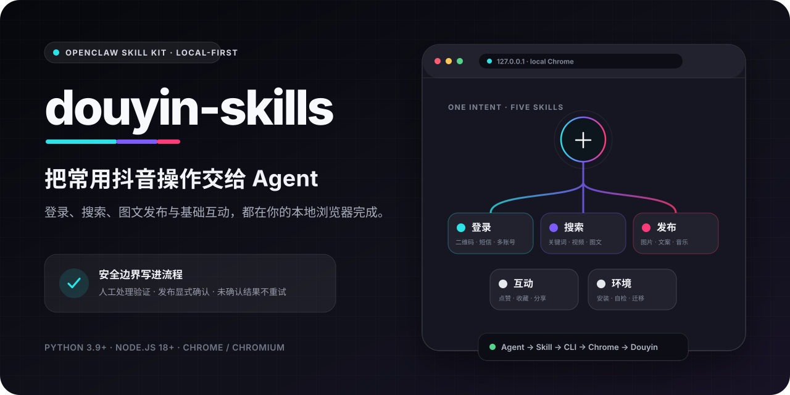
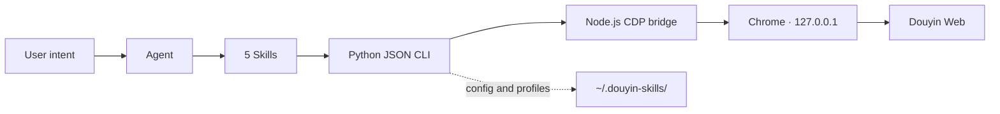

<p align="right"><a href="./README.zh-CN.md">简体中文</a></p>

<p align="center">
  
</p>

<h1 align="center">douyin-skills</h1>

<p align="center">
  Control your local Chrome with natural language for Douyin login, discovery, photo publishing, and basic interactions.
</p>

<p align="center">
  <a href="https://github.com/zJay26/douyin-skills/actions/workflows/ci.yml"></a>
  <a href="https://github.com/zJay26/douyin-skills/stargazers"></a>
  <a href="./LICENSE"></a>
  
  
  <a href="https://docs.openclaw.ai/skills"></a>
</p>

> [!IMPORTANT]
> This is a local, human-in-the-loop web automation toolkit—not an official Douyin product. Only use accounts and content you are authorized to operate. Users must complete captchas and risk checks themselves; this project does not provide bulk engagement or platform-control bypasses.

## Why use it?

Everyday Douyin web tasks are not inherently complicated, but browser startup, login state, page transitions, and publish review can interrupt your flow. `douyin-skills` turns those steps into five composable Skills: your agent understands the intent, then acts through Chrome on your computer.

| What you can say | Capability | Guardrail |
| --- | --- | --- |
| “Check login and show me the QR code if needed” | QR, SMS verification, multiple accounts | The user completes verification |
| “Find five weekend camping posts” | Keyword search, video/photo details | Up to 20 public posts per search |
| “Fill in these photos and caption, but do not publish” | Uploads, copy, music, page validation | Photo posts only; review first |
| “Everything looks right—publish it” | Explicit publish confirmation | Never retry an unknown result |
| “Favorite this post and send me its link” | Like, favorite, share URL | No bulk actions or inflated claims |

What makes it different:

- **Built for everyday users**: install it, then describe the task instead of learning CDP or selectors.
- **Local-first**: Chrome and account profiles stay on your computer; the debug endpoint only listens on `127.0.0.1`.
- **Fails safely**: publishing requires validation and explicit confirmation; risk pages and uncertain outcomes stop for human review.
- **Composable**: authentication, environment, discovery, publishing, and interactions work independently or as a workflow.
- **Maintainable**: one JSON CLI, unit tests, cross-platform CI, and Skills that document the real runtime contract.

## Start in three minutes

### Option 1: Install from Git with OpenClaw (recommended)

```bash
openclaw skills install git:zJay26/douyin-skills@main
```

Then tell your agent:

> Use `douyin-env` to install dependencies and run the environment checks.

This installation command and Skill discovery model follow the [official OpenClaw documentation](https://docs.openclaw.ai/skills).

### Option 2: Install manually

```bash
git clone https://github.com/zJay26/douyin-skills.git
cd douyin-skills
npm install
python scripts/cli.py doctor
```

You can also choose **Code → Download ZIP** on GitHub, extract the complete directory, and run the same `npm install` and `doctor` commands. Replace `python` with `python3` if needed.

The environment is ready when the JSON from `doctor` contains `"success": true` and an empty `required_failures` list.

## Your first workflow

1. **Check the environment**

   > Use `douyin-env` to configure and verify this Skill.

2. **Sign in**

   > Check Douyin login with the default account. If I am signed out, show me the QR code.

3. **Describe the task**

   > Search for “city night photography” and return five titles, authors, content types, and links.

   > With my work account, fill the photo-publishing form with these three images and this caption. Pick suitable music, but stop before publishing.

4. **Confirm publishing separately**

   > I reviewed the page. Publish once, and do not retry if the result is not explicitly confirmed.

The first login creates an isolated local Chrome profile. If Douyin later presents a captcha, identity check, or risk page, the CLI switches to a visible browser and waits for you to complete it manually.

## Five composable Skills

| Skill | Responsibility | Example intent |
| --- | --- | --- |
| [`douyin-auth`](./skills/douyin-auth/SKILL.md) | Login state, QR, SMS verification, multiple accounts | “Switch to my work account and check login” |
| [`douyin-explore`](./skills/douyin-explore/SKILL.md) | Search public posts and read video/note details | “Find seven camping posts” |
| [`douyin-publish`](./skills/douyin-publish/SKILL.md) | Fill photo posts, select music, validate, confirm | “Prepare this post for my review” |
| [`douyin-interact`](./skills/douyin-interact/SKILL.md) | One like/favorite click or a public share URL | “Favorite this and return the link” |
| [`douyin-env`](./skills/douyin-env/SKILL.md) | Installation, diagnostics, migration | “Check Chrome and dependencies” |

The root [`SKILL.md`](./SKILL.md) routes multi-step requests. Child Skills address scripts with OpenClaw's recommended [`{baseDir}` convention](https://docs.openclaw.ai/tools/creating-skills), so execution does not depend on the agent's current working directory.

## Safety model and scope

### What it does

- Operates public pages on Douyin Web and Creator Center Web.
- Keeps login state in loopback-only Chrome and supports named, isolated profiles.
- Shows the browser and waits when captcha or identity verification is required.
- Checks title, body, images, music, and button state before publishing.
- Returns explicit states for uncertain page outcomes and asks for human verification.

### What it deliberately does not do

- Bypass captchas, identity checks, risk controls, or platform rate limits.
- Comment, reply, send direct messages, publish videos, save drafts, or schedule posts.
- Farm accounts, inflate engagement, scrape entire profiles, or run bulk operating pipelines.
- Retry when publishing is uncertain, or click like/favorite again when the final state is unknown.

> [!WARNING]
> Web interfaces change and automation may be restricted by the platform. Use a reasonable frequency and verify important actions on the actual page. You remain responsible for applicable law, platform rules, and content permissions.

## Architecture



- `scripts/cli.py` is the only public command entry point and always produces JSON.
- Python uses only the standard library; the Node.js side only depends on the lockfile-pinned `ws` package.
- The Chrome launcher handles cross-platform browser discovery, port checks, profile isolation, and headless/headed transitions.
- The CDP bridge drives pages through timeout-bounded HTTP/WebSocket calls without exposing the debug port to LAN or public networks.
- Page logic is split into authentication, discovery, publishing, and interaction modules, with shared URL, wait, and error handling.

## Requirements

| Component | Minimum / requirement |
| --- | --- |
| Python | 3.9+, standard library only |
| Node.js | 18+ |
| npm | Used by `npm install` / `npm ci` |
| Chrome / Chromium | Must support remote debugging |
| Graphical display | Only needed for human captcha, identity, or risk checks |

The CLI searches PATH and common browser locations on Windows, macOS, Linux, and WSL. You can also specify an executable explicitly:

```bash
CHROME_BIN=/absolute/path/to/chrome python scripts/cli.py doctor
```

When a Linux container runs as root, the launcher adds Chrome's required `--no-sandbox` flag. It does not disable the browser sandbox for regular users.

## CLI reference

Every command returns JSON. Put global account options before the subcommand:

```bash
python scripts/cli.py --account work check-login
```

| Area | Command | Purpose |
| --- | --- | --- |
| Environment | `doctor` | Check Python, Node.js, `ws`, Chrome, and display availability |
| Auth | `check-login` | Inspect login, risk, and human-verification state |
| Auth | `get-qrcode` / `wait-login` | Retrieve a QR image and wait once for scanning |
| Auth | `send-code` / `verify-code` | Send and verify an SMS code |
| Accounts | `list-accounts` | List named accounts and the current default |
| Accounts | `add-account` / `remove-account` | Register or remove a named account |
| Accounts | `set-default-account` | Select the default named account |
| Discovery | `search-videos` | Keyword search; seven by default, twenty maximum |
| Discovery | `get-video-detail` | Read a numeric ID or public video/note URL |
| Publishing | `fill-publish-image` | Validate absolute image paths and fill the photo form |
| Publishing | `select-music` | Select the first available candidate by name |
| Publishing | `validate-publish` | Inspect fields and button state without publishing |
| Publishing | `click-publish --confirm` | Explicitly confirm one publish click |
| Interaction | `like-video` / `favorite-video` | Perform one button click for one explicit post |
| Interaction | `share-video` | Return a public URL and attempt to copy it |

Run `python scripts/cli.py --help` or a subcommand's `--help` for every option.

### Publishing states are not interchangeable

| State | Meaning | Next step |
| --- | --- | --- |
| `publish_confirmed` | The page exposed an explicit success signal | Report confirmed publication |
| `publish_clicked_unconfirmed` | The button was clicked, but the result is not reliable | Check Creator Center and **do not retry** |
| `success: false` | No click occurred, or preflight validation failed | Fix `validation.errors` |

Likes and favorites may similarly return `state_verified: false`. That proves a click occurred, not the final state; the agent should say so and avoid repeating the action.

## Local data

The default data directory is `~/.douyin-skills/`; set `DOUYIN_SKILLS_HOME` to use another local path. It may contain named-account configuration, runtime state, and Chrome profiles:

- Do not commit it to Git.
- Do not upload it to cloud drives, issues, or third-party services.
- `remove-account` unregisters the account but does not promise to delete profile data.
- Back up and report corrupt configuration instead of rebuilding or overwriting it automatically.

## Repository layout

```text
.
├── SKILL.md                  # Multi-step entry point and shared guardrails
├── skills/                   # Five composable child Skills
├── scripts/
│   ├── cli.py                # Unified JSON CLI
│   ├── doctor.py             # Environment diagnostics
│   ├── chrome_launcher.py    # Chrome lifecycle and profiles
│   ├── cdp_client.mjs        # Node.js CDP bridge
│   └── douyin/               # Auth, discovery, publish, interaction modules
├── tests/                    # Python unit tests and Node.js bridge test
├── assets/                   # README and social-preview artwork
└── .github/                  # CI, dependency updates, collaboration templates
```

## Development and verification

```bash
npm ci
python -m compileall -q scripts tests/python
python -m unittest discover -s tests/python -v
npm run check
npm test

python -m pip install ruff==0.16.2
ruff check scripts tests/python
ruff format --check scripts tests/python
```

CI tests Windows (Python 3.13 / Node.js 24) and Ubuntu (Python 3.9 / Node.js 18), with a separate Ruff check. CI does not perform real account login, captcha, or publishing; those end-to-end outcomes still depend on the account, page version, and platform policy at that moment.

Read [CONTRIBUTING.md](./CONTRIBUTING.md) before sending changes. Report security problems privately through [SECURITY.md](./SECURITY.md), and never paste account or session data into a public issue.

## FAQ

<details>
<summary><strong>Does it upload my account data?</strong></summary>

The project has no remote-control service. It talks to Chrome on `127.0.0.1`, and account configuration and profiles stay local by default. Chrome still communicates with Douyin normally when you visit the website.
</details>

<details>
<summary><strong>Why did a visible browser window appear?</strong></summary>

The CLI detected a captcha, identity check, or risk page and switched to headed mode for manual completion. It does not attempt to bypass the check.
</details>

<details>
<summary><strong>What if publishing has no clear success message?</strong></summary>

If the state is `publish_clicked_unconfirmed`, check Creator Center first. Do not click again because that may create a duplicate post.
</details>

<details>
<summary><strong>Does it support videos, comments, or bulk operations?</strong></summary>

No. The project intentionally focuses on small, clear local workflows: login, discovery, photo publishing, and one-at-a-time basic interactions.
</details>

## Contributing, license, and trademarks

Focused, tested contributions that preserve the safety model are welcome. Start with [CONTRIBUTING.md](./CONTRIBUTING.md).

This project is available under the [MIT License](./LICENSE). `douyin-skills` is not affiliated with, authorized by, or officially connected to Douyin, ByteDance, or OpenClaw. Product names are used only to identify compatibility.

<p align="center">
  If this makes your workflow easier, consider leaving a Star so more people can discover local, controllable automation.
</p>
