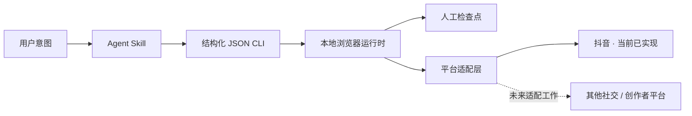
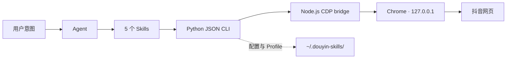

<p align="right"><a href="./README.md">English</a></p>

<p align="center">
  
</p>

<h1 align="center">douyin-skills</h1>

<p align="center">
  面向社交网络的本地 Agent 工作流——从抖音开始。
</p>

<p align="center">
  <a href="https://github.com/zJay26/douyin-skills/actions/workflows/ci.yml"></a>
  <a href="https://github.com/zJay26/douyin-skills/stargazers"></a>
  <a href="./LICENSE"></a>
  <a href="https://agentskills.io"></a>
  <a href="https://docs.openclaw.ai/skills"></a>
  
</p>

> [!IMPORTANT]
> 当前仓库真正实现的是抖音工作流。其他 Agent 客户端与其他社交平台属于可复用方向，不是已经交付的兼容能力。本项目不是抖音官方产品，也不提供批量刷量或绕过平台限制的能力。

## 这个项目为什么存在

Agent 可以规划多步骤任务，但真正进入社交网站后，还要面对持续登录状态、不断变化的页面、风控验证，以及可能产生真实后果的发布按钮。一次点击不能被轻率地等同于成功，一个无法确认的结果也不应该被 Agent 自信地汇报为已完成。

`douyin-skills` 尝试把这条边界做得更清楚：用可版本管理的 Skill 描述意图和约束，用结构化 JSON CLI 执行浏览器动作，把账号会话保留在本机 Chrome 中，并在验证页或结果不确定时停下来交给用户。

抖音是当前的落地点，也是一个足够真实的检验场景。项目并不是批量运营套件，而是先把登录、搜索、图文发布和基础互动做成小而可核对的构件。

## 当前已经能做什么

很多抖音网页操作并不复杂，但登录状态、浏览器启动、页面切换和发布复核很容易打断工作。`douyin-skills` 把这些步骤拆成 5 个可组合的 Skill，让 Agent 理解你的意图，再通过本机浏览器执行。

| 你可以直接说 | 对应能力 | 关键边界 |
| --- | --- | --- |
| “检查登录，没登录就把二维码给我” | 二维码、短信验证、多账号 | 验证由用户亲自完成 |
| “搜索周末露营，给我 5 条结果” | 关键词搜索、视频/图文详情 | 单次最多 20 条公开作品 |
| “把这些图片和文案填好，先别发布” | 图片上传、文案、音乐、页面校验 | 只支持图文，发布前复核 |
| “确认无误后发布” | 显式发布确认 | 状态未知时绝不自动重试 |
| “收藏这条，并把链接发给我” | 点赞、收藏、分享链接 | 不批量操作，不夸大最终状态 |

核心特点：

- **普通用户先行**：安装后直接用自然语言，不需要先理解 CDP 或页面选择器。
- **Agent 可读契约**：Skill 指令和 JSON 结果可以被检查，不把关键行为藏在临时 Prompt 里。
- **本地优先**：浏览器和账号 Profile 留在本机，调试端口只监听 `127.0.0.1`。
- **安全地失败**：发布前强制校验和显式确认；验证码、风控与不确定结果都会停下来交给用户。
- **可组合**：认证、环境、发现、发布、互动各自独立，也能串成完整流程。
- **可维护**：统一 JSON CLI、单元测试、双平台 CI、原子化 Skill 文档。

## 看一遍完整的安全流程

<p align="center">
  
</p>

这段 40 秒演示完全由合成数据生成：不会发起网络请求，也不包含真实抖音页面、账号、Cookie、二维码、手机号、Profile 路径或用户内容。它只展示控制流程，并刻意停在 **Prepared · not published**。它不能证明任意线上页面版本或账号已经通过端到端验证。

演示源码位于 [`assets/demo/index.html`](./assets/demo/index.html)。维护者安装 Chrome 与 FFmpeg 后可运行 `npm run render:demo` 复现 GIF。

## 3 分钟上手

### 方式一：让 OpenClaw 从 Git 安装（推荐）

```bash
openclaw skills install git:cd-JJGong/douyin-skills@main
```

然后告诉 Agent：

> 使用 `douyin-env` 完成依赖安装和环境自检。

该安装方式与 Skill 发现规则来自 [OpenClaw 官方文档](https://docs.openclaw.ai/skills)。

### 方式二：手动安装

```bash
git clone https://github.com/cd-JJGong/douyin-skills.git
cd douyin-skills
npm install
python scripts/cli.py doctor
```

也可以在仓库页面选择 **Code → Download ZIP**，解压完整目录后运行同样的 `npm install` 和 `doctor`。如果系统只有 `python3`，请替换示例中的 `python`。

环境就绪的判断标准是：`doctor` 返回的 JSON 中 `success` 为 `true`，且 `required_failures` 为空。

## 第一次使用

1. **检查环境**

   > 使用 `douyin-env` 检查并配置这个 Skill。

2. **完成登录**

   > 用默认账号检查抖音登录状态；如果没登录，把二维码展示给我。

3. **直接描述任务**

   > 搜索“城市夜景”，列出 5 条作品的标题、作者、类型和链接。

   > 用工作账号把这 3 张图片和文案填进图文发布页，选择合适音乐，只预览，不要发布。

4. **单独确认发布**

   > 我已经检查页面，确认发布。如果发布结果没有明确确认，不要重试。

首次登录会保存独立的本地 Chrome Profile。偶尔出现验证码、身份验证或风控页时，CLI 会切换为可见浏览器，等你手动处理后再继续。

## 它对 Agent 生态的意义

这个仓库更大的价值，不是宣称已经统一了所有社交平台，而是把“Agent 决定做什么”和“真实浏览器被允许做什么”分开。

| 层次 | 当前仓库给出的实现 | 可以复用的方向 |
| --- | --- | --- |
| Skill 契约 | 在 `SKILL.md` 中记录意图、步骤、安全边界与失败处理 | 可被理解开放 Agent Skills 格式的客户端读取 |
| 执行契约 | 明确参数和结构化 JSON 结果 | 其他 Agent 或工具协议可以复用同一个 CLI 边界 |
| 本地会话 | 独立 Chrome Profile 与仅限 loopback 的 CDP | 适合需要用户保持登录、又不希望上传会话的场景 |
| 人工检查点 | 可见浏览器验证与显式发布确认 | 可用于其他高风险或不可逆网页动作 |
| 结果语义 | 区分已确认、未执行和点击后无法确认 | 减少 Agent 过度自信地汇报完成 |
| 平台适配层 | 抖音 URL、选择器和创作者流程位于共享运行时之后 | 未来平台可以替换适配层，而不必放弃全部安全约束 |

根目录 [`SKILL.md`](./SKILL.md) 采用开放的 [Agent Skills 规范](https://agentskills.io/specification)。OpenClaw 同样遵循该规范，并且是当前仓库已经写明完整安装流程的客户端。其他客户端的执行兼容尚未进入 CI，因此这里强调的是可复用结构，不是“开箱即用支持所有 Agent”。

## 从抖音开始，但不只考虑抖音

当前实现仍然是抖音专用的：URL、页面选择器、登录页、创作者表单和内容类型都不能直接搬到另一家平台。更通用的是它们外围的结构：



未来如果为其他社交或创作者平台增加适配器，可以复用 Skill 到 CLI 的边界、浏览器生命周期、本地 Profile、超时、结果状态与人工复核策略；但仍必须重新实现并验证登录、URL、选择器、业务规则和平台合规边界。

当前仓库没有交付其他平台适配器。更完整的边界说明见 [Agent 生态设计说明](./docs/AGENT_ECOSYSTEM.md)，阶段计划见 [ROADMAP.md](./ROADMAP.md)。

## 5 个可组合 Skills

| Skill | 负责什么 | 典型意图 |
| --- | --- | --- |
| [`douyin-auth`](./skills/douyin-auth/SKILL.md) | 登录状态、二维码、短信验证、多账号 | “切到工作号并检查登录” |
| [`douyin-explore`](./skills/douyin-explore/SKILL.md) | 搜索公开作品、读取 video/note 详情 | “查找 7 条露营内容” |
| [`douyin-publish`](./skills/douyin-publish/SKILL.md) | 填写图文、选音乐、校验、确认发布 | “填好内容，先让我复核” |
| [`douyin-interact`](./skills/douyin-interact/SKILL.md) | 单次点赞、收藏、获取分享链接 | “收藏这条并返回链接” |
| [`douyin-env`](./skills/douyin-env/SKILL.md) | 安装、自检、迁移、环境排障 | “检查 Chrome 和依赖” |

主入口 [`SKILL.md`](./SKILL.md) 负责多步骤路由。子 Skill 内的脚本路径使用 OpenClaw 推荐的 [`{baseDir}` 规则](https://docs.openclaw.ai/tools/creating-skills)，因此不依赖 Agent 当前所在目录。

## 安全设计与能力边界

### 会做

- 通过抖音网页版 / 创作者中心网页版操作公开页面。
- 在 loopback Chrome 中保留登录状态并支持多个命名 Profile。
- 在需要验证码或身份验证时展示浏览器，等待用户处理。
- 发布前检查标题、正文、图片、音乐和按钮状态。
- 对不确定的页面结果返回明确状态，提醒用户人工确认。

### 不会做

- 绕过验证码、身份验证、风控或平台频率限制。
- 评论、回复评论、私信、视频发布、草稿或定时发布。
- 批量养号、刷量、批量互动、用户主页全量抓取或完整运营流水线。
- 在发布结果未知时自动重试，或在点赞/收藏状态未知时再次点击。

> [!WARNING]
> 网页结构会变化，自动化也可能被平台限制。请保持合理频率，并在重要操作后查看真实页面。使用者需要自行遵守适用法律、平台规则和内容授权要求。

## 当前实现架构



- `scripts/cli.py` 是唯一公开命令入口，成功与失败都输出 JSON。
- Python 只使用标准库；Node.js 端仅依赖 `ws`，版本由 `package-lock.json` 锁定。
- Chrome launcher 负责跨平台查找浏览器、端口检查、Profile 隔离和 headless/headed 切换。
- CDP bridge 通过超时受控的 HTTP/WebSocket 调用驱动页面，不向局域网或公网暴露调试端口。
- 页面模块按认证、搜索、发布和互动拆分，公共 URL、等待与错误处理单独复用。
- 当前平台代码还不是通用适配器；[Agent 生态设计说明](./docs/AGENT_ECOSYSTEM.md)列出了在尝试第二个平台前应当抽离的边界。

## 环境要求

| 组件 | 最低版本 / 要求 |
| --- | --- |
| Python | 3.9+，仅标准库 |
| Node.js | 18+ |
| npm | 用于 `npm install` / `npm ci` |
| Chrome / Chromium | 支持 remote debugging |
| 图形环境 | 仅在人工验证码、身份验证或风控阶段必需 |

CLI 会检查 PATH 和 Windows、macOS、Linux、WSL 的常见浏览器位置。也可以显式指定：

```bash
CHROME_BIN=/absolute/path/to/chrome python scripts/cli.py doctor
```

Linux 容器以 root 运行时会按 Chrome 要求加入 `--no-sandbox`；普通用户环境不会主动关闭浏览器沙箱。

## CLI 参考

所有命令均返回 JSON。使用命名账号时，把全局参数放在子命令之前：

```bash
python scripts/cli.py --account work check-login
```

| 分类 | 命令 | 说明 |
| --- | --- | --- |
| 环境 | `doctor` | 检查 Python、Node.js、`ws`、Chrome 和图形环境 |
| 认证 | `check-login` | 检查登录、风控与人工验证状态 |
| 认证 | `get-qrcode` / `wait-login` | 获取二维码并单次等待扫码结果 |
| 认证 | `send-code` / `verify-code` | 发送与校验短信验证码 |
| 账号 | `list-accounts` | 列出命名账号与默认账号 |
| 账号 | `add-account` / `remove-account` | 登记或移除命名账号 |
| 账号 | `set-default-account` | 设置默认命名账号 |
| 发现 | `search-videos` | 按关键词搜索，默认 7 条、最多 20 条 |
| 发现 | `get-video-detail` | 读取数字 ID 或公开 video/note 链接 |
| 发布 | `fill-publish-image` | 校验绝对图片路径并填写图文表单 |
| 发布 | `select-music` | 按候选名称选择可用音乐 |
| 发布 | `validate-publish` | 读取发布页字段和按钮状态，不点击发布 |
| 发布 | `click-publish --confirm` | 显式确认后执行一次发布点击 |
| 互动 | `like-video` / `favorite-video` | 对明确作品执行一次按钮点击 |
| 互动 | `share-video` | 返回作品公开链接，并尽力写入剪贴板 |

运行 `python scripts/cli.py --help` 或对应子命令的 `--help` 查看完整参数。

### 发布状态不能混为一谈

| 返回状态 | 含义 | 下一步 |
| --- | --- | --- |
| `publish_confirmed` | 页面出现明确成功信号 | 可以报告已确认发布 |
| `publish_clicked_unconfirmed` | 已点击，但页面没有给出可靠结果 | 去作品管理核对，**不要重试** |
| `success: false` | 没有点击，或发布前校验失败 | 根据 `validation.errors` 修复 |

点赞与收藏也可能返回 `state_verified: false`。这只证明按钮已点击，不能证明最终状态；Agent 应如实说明并停止重复操作。

## 本地数据

默认数据目录为 `~/.douyin-skills/`，可以通过 `DOUYIN_SKILLS_HOME` 改到其他本地位置。这里可能包含命名账号配置、运行状态和 Chrome Profile：

- 不要提交到 Git 仓库。
- 不要上传到网盘、Issue 或第三方服务。
- `remove-account` 只移除账号登记，不承诺删除 Profile 数据。
- 配置损坏时先备份并报告，不自动重建或覆盖。

## 项目结构

```text
.
├── SKILL.md                  # 多步骤入口与共同约束
├── skills/                   # 5 个可组合子 Skill
├── scripts/
│   ├── cli.py                # 统一 JSON CLI
│   ├── doctor.py             # 环境诊断
│   ├── chrome_launcher.py    # Chrome 生命周期与 Profile
│   ├── cdp_client.mjs        # Node.js CDP bridge
│   └── douyin/               # 认证、发现、发布、互动模块
├── tests/                    # Python 单元测试与 Node.js bridge 测试
├── assets/                   # README 与社交预览视觉资产
├── docs/                     # Agent 生态与适配器设计说明
├── ROADMAP.md                # 以验证证据为门槛的路线图
└── .github/                  # CI、依赖更新与协作模板
```

## 开发与验证

```bash
npm ci
python -m compileall -q scripts tests/python
python -m unittest discover -s tests/python -v
npm run check
npm test

python -m pip install ruff==0.16.2
ruff check scripts tests/python
ruff format --check scripts tests/python
```

CI 在 Windows（Python 3.13 / Node.js 24）与 Ubuntu（Python 3.9 / Node.js 18）运行测试，并单独检查 Ruff。真实账号登录、验证码和发布不会在 CI 中执行；这类端到端结果仍取决于当时的账号、页面和平台策略。

参与开发前请阅读 [CONTRIBUTING.md](./CONTRIBUTING.md)。开放式工作流和适配器想法可以放到 [GitHub Discussions](https://github.com/zJay26/douyin-skills/discussions)，可复现缺陷与范围明确的工作使用 Issues。安全问题请按 [SECURITY.md](./SECURITY.md) 私下报告，不要在公开 Issue 中粘贴账号或会话数据。

## 常见问题

<details>
<summary><strong>账号信息会被上传吗？</strong></summary>

项目没有远程控制服务；它通过 `127.0.0.1` 连接本机 Chrome，账号配置与 Profile 默认保存在本机。浏览器访问抖音时仍会按网站本身的方式与平台通信。
</details>

<details>
<summary><strong>为什么浏览器突然变成可见窗口？</strong></summary>

CLI 检测到验证码、身份验证或风控页后会切到 headed 模式，让用户手动处理。它不会尝试自动绕过。
</details>

<details>
<summary><strong>点击发布后没有明确成功提示怎么办？</strong></summary>

如果状态是 `publish_clicked_unconfirmed`，先去作品管理核对。不要再次点击，否则可能重复发布。
</details>

<details>
<summary><strong>支持视频、评论或批量运营吗？</strong></summary>

目前不支持。项目专注小而清晰的本地工作流：登录、搜索、图文发布和单次基础互动。
</details>

## 贡献、许可与声明

欢迎提交聚焦、可测试且符合安全边界的 Issue 与 Pull Request。可从页面兼容性复现、选择器 fixture、更清楚的结果语义、其他 Agent Skills 客户端安装文档，以及平台适配层设计开始。请先阅读 [参与贡献](./CONTRIBUTING.md)和[路线图](./ROADMAP.md)。

本项目采用 [MIT License](./LICENSE)。`douyin-skills` 与抖音、字节跳动及 OpenClaw 均无隶属、授权或官方合作关系；产品名称仅用于说明兼容对象。

<p align="center">
  如果你实际使用过它，欢迎告诉我们哪一步有帮助、哪一步失败了。真实使用反馈比宽泛的兼容性口号更有价值。
</p>
